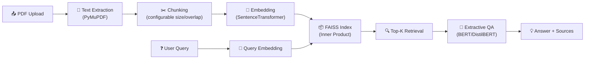

# RAG-based PDF Question Answering System

A Retrieval-Augmented Generation (RAG) pipeline that lets you upload any PDF, ask natural-language questions about its content, and get extractive answers with full source transparency.

Built with **Streamlit + SentenceTransformers + FAISS + Hugging Face Transformers** — no API keys, no cloud dependencies.

## Features

- **PDF Upload Pipeline** — Upload any PDF → automatic text extraction → configurable chunking
- **FAISS Vector Retrieval** — Fast approximate nearest-neighbor search (~100× faster than brute-force cosine similarity)
- **Extractive QA** — BERT-Large or DistilBERT extracts precise answers from retrieved chunks
- **Source Transparency** — Every answer shows the retrieved source chunks with similarity scores and page numbers
- **Configurable Parameters** — Tune chunk size, overlap, top-k, and QA model via the sidebar
- **Cached Model Loading** — Models load once via `@st.cache_resource`, not on every query
- **Retrieval Evaluation** — Recall@1/3/5 metrics across a chunk-size × top-k experiment grid

## Architecture



## Project Structure

```
RAG_based_qna/
├── app.py                          # Streamlit entry point
├── src/
│   ├── __init__.py
│   ├── config.py                   # Centralized configuration
│   ├── pdf_processor.py            # PDF → text → chunks
│   ├── embeddings.py               # SentenceTransformer + FAISS
│   ├── retriever.py                # Top-k retrieval
│   └── qa_model.py                 # Extractive QA models
├── evaluation/
│   ├── eval_dataset.json           # 20 ground-truth Q&A pairs
│   ├── run_evaluation.py           # Recall@k experiment grid
│   └── results/                    # Output CSVs and heatmaps
├── sample_data/
│   └── ConceptsofBiology.pdf       # Sample PDF for testing
├── requirements.txt
└── README.md
```

## 🚀 Quickstart

### Prerequisites

- Python 3.12+
- pip

### Installation

```bash
# Clone the repository
git clone <repo-url>
cd rag-based-qna

# Install dependencies
pip install -r requirements.txt
```

### Run the App

```bash
streamlit run app.py
```

Then:
1. Upload a PDF in the sidebar (or use `sample_data/ConceptsofBiology.pdf`)
2. Adjust chunk size, overlap, and top-k as desired
3. Type a question and get an answer with source chunks

### Run the Evaluation

```bash
python -m evaluation.run_evaluation
```

This runs a grid search over:
- **Chunk sizes**: 300, 500, 700, 1000 characters
- **Top-K values**: 1, 3, 5, 7

And outputs:
- `evaluation/results/recall_results.csv` — per-question results
- `evaluation/results/recall_summary.csv` — aggregated Recall@k
- `evaluation/results/recall_heatmap.png` — visual comparison

## 📊 Evaluation Methodology

### Dataset
20 hand-crafted questions spanning 14 topics from the biology textbook, with:
- Known expected answers
- Keyword-based relevance criteria for chunk matching
- Difficulty levels (easy / medium / hard)

### Metrics
- **Recall@1**: Was a relevant chunk the single top result?
- **Recall@3**: Was a relevant chunk in the top 3 results?
- **Recall@5**: Was a relevant chunk in the top 5 results?

### Experiment Design
A full grid search over `chunk_size × top_k` measures how chunking granularity and retrieval depth affect retrieval quality. Results are visualized as heatmaps.

## ⚙️ Configuration

All defaults are in [`src/config.py`](src/config.py):

| Parameter | Default | Range | Description |
|-----------|---------|-------|-------------|
| Chunk Size | 500 chars | 200–1000 | Maximum characters per chunk |
| Chunk Overlap | 50 chars | 0–200 | Overlap between consecutive chunks |
| Top-K | 5 | 1–10 | Number of chunks retrieved per query |
| Embedding Model | `paraphrase-mpnet-base-v2` | — | SentenceTransformer model |
| QA Model | DistilBERT (Fast) | BERT-Large / DistilBERT | Extractive QA model |

## 🔧 Tech Stack

| Component | Library | Purpose |
|-----------|---------|---------|
| UI | Streamlit | Interactive web interface |
| Embeddings | SentenceTransformers | Dense text embeddings |
| Vector Search | FAISS (faiss-cpu) | Fast similarity retrieval |
| QA | Hugging Face Transformers | Extractive question answering |
| PDF Parsing | PyMuPDF | Text extraction from PDFs |
| Evaluation | pandas + matplotlib + seaborn | Metrics and visualization |

## 🔮 Future Improvements

- Add support for multi-document querying (upload multiple PDFs)
- Experiment with different embedding models (e.g., `all-MiniLM-L6-v2`)
- Implement re-ranking with a cross-encoder for improved precision
- Add abstractive QA using a generative model (e.g., FLAN-T5)
- Persist FAISS indices to disk for faster re-loading of previously processed PDFs
- Add end-to-end answer quality evaluation (Exact Match / F1)
